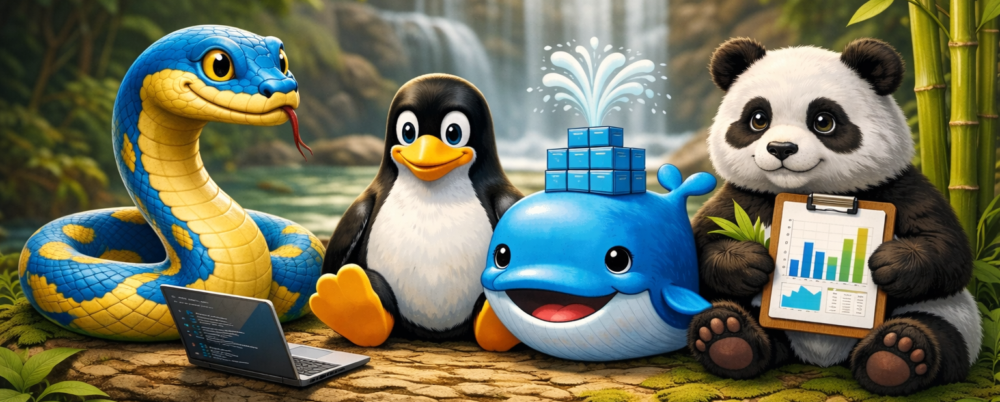

## Introducing Myself 👋

Hello, I’m Pedro. I hold a Bachelor’s degree in Physics Engineering from UFMS. My work focuses on data science, applied machine learning and MLOps, with an emphasis on production-grade systems.

I design and build end-to-end machine learning systems, from exploratory analysis to automated deployment, monitoring, and retraining in production environments.

---
## 🛠️ Technical Stack

- Programming & Data – Python, SQL
- MLOps & Production – MLflow, Prefect, GitHub Actions, Docker, Evidently, Prometheus, Grafana, FastAPI.  
- Cloud – AWS (EC2, S3). 
- Modeling – Supervised and unsupervised on tabular. NLP and Computer Vision (foundational). 
- Tools – Ubuntu, Pandas, Numpy, Scikit-learn, PyTorch, Optuna, Matplotlib, Seaborn, Tableu, Poetry, Notion. 

 

---
## 🚀 Project: End-to-End MLOps System

🔹 **Churn Prediction System (Production-Oriented)**  
- An end-to-end machine learning system focused on automation, scalability, and monitoring.
- Full ML lifecycle: EDA → training → deployment → monitoring → automated retraining

👉 **[`View the project repository`](https://github.com/Pedro-Vital/churn-project)**

---
📫 Reach me: `pedrosalazarvital@gmail.com`
