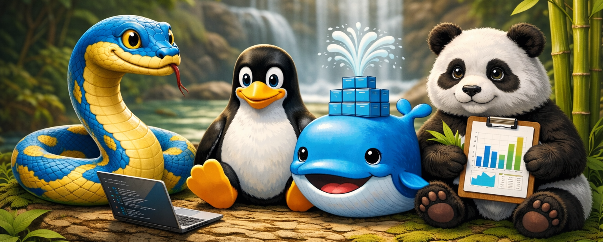

## Introducing Myself 👋

Hello, I’m Pedro — an ML & AI Engineer and Data Scientist with a background in Engineering Physics from UFMS.

My work focuses on building production-grade AI systems, combining machine learning engineering, LLM applications, retrieval systems, agentic workflows, and MLOps practices.

I design systems across the full AI lifecycle:\
data → training → orchestration → deployment → evaluation → monitoring → continuous improvement.

---
## 🛠️ Technical Stack

- Programming & Data: Python, SQL
- ML:  Supervised & Unsupervised Learning, Deep Learning, NLP, Computer Vision, XGBoost,  K-Means
- Data & Scientific Computing: Pandas, NumPy, Scikit-learn, PyTorch, PySpark, Matplotlib, Seaborn
- MLOps & Deployment: MLflow, Prefect, Docker, FastAPI, CI/CD (GitHub Actions), AWS (EC2, S3)
- Monitoring & Observability: Evidently, Prometheus, Grafana
- AI Engineering & LLMs: RAG, Agentic AI, LLM orchestration, Prompt Engineering, Tool Calling
- Frameworks & Ecosystem: LangChain, LangGraph, LangSmith, OpenAI API, OpenAI Agents SDK, CrewAI, AutoGen, MCP (Model Context Protocol), Hugging Face Transformers
- Retrieval & Vector Databases: Embeddings, Vector Search, FAISS, Chroma, Hybrid Search

---
## 🚀 PROJECTS

### End-to-End MLOps System

🔹 **Churn Prediction System (Production-Oriented)**  
- An end-to-end machine learning system focused on automation, scalability, and monitoring
- Full ML lifecycle: EDA → training → deployment → monitoring → automated retraining

👉 **[`View the churn project repository`](https://github.com/Pedro-Vital/churn-project)**

### RAG Systems and Agentic AI Workflows

- RAG pipelines from foundational to agentic architectures
- Multi-agent systems using LangGraph, CrewAI, OpenAI Agents SDK and MCP

👉 **[`View the RAG repository`](https://github.com/Pedro-Vital/rag-academic)**\
👉 **[`View the Agentic AI repository`](https://github.com/Pedro-Vital/agentic-ai-academic)**

---
📫 Reach me: `pedrosalazarvital@gmail.com`

